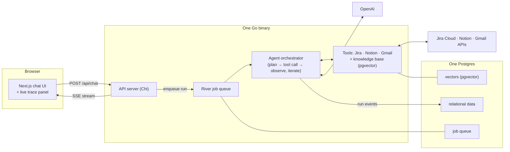

# Cortex

**An AI analyst for your organization's project data.**

Cortex connects to live enterprise sources — Jira, Notion, Gmail — and answers complex questions by autonomously investigating across them: planning what it needs to know, calling the right tools, reasoning across the evidence, and returning answers with citations back to the underlying sources. Ask *"Why was the payment integration delayed and how did it affect the launch date?"* and Cortex reads the blocked tickets in Jira, finds the vendor named only in the Notion plan, digs the root cause out of a Gmail thread, and assembles the chain — with a citation for every claim.

Every run is fully traceable. Each investigation is an agent loop whose every step — LLM call, tool call, retrieved document, reasoning summary — is persisted as an event stream and replayed live into the UI's trace panel, so you can watch the agent pivot from Jira to Notion to Gmail as it happens, then audit the finished run event by event. Answers cite their evidence; claims the sources don't support are refused rather than invented.

## Architecture



The flow: a chat message enqueues an agent run; a River worker executes the agent loop — the LLM decides which tool to call next, observes the result, and iterates until it can answer (or honestly can't). Every tool result carries evidence metadata, so the final answer's citations point at real Jira issues, Notion pages, and Gmail messages. The API streams the run's event log to the browser over SSE while it happens.

## The design story: one binary, one database, zero frameworks

The entire backend is a single Go binary — API server, job queue workers, and agent orchestrator in one process — against a single Postgres that holds the relational data, the vector index, and the job queue. The agent loop is hand-written Go against the OpenAI API, not a framework.

Deliberately excluded, and why:

| Excluded | Reason |
|---|---|
| LangChain / LangGraph | The agent loop **is** the product; a framework would erase the demonstrated skill. Also Python/TS-first — `langchaingo` is second-class. |
| Pinecone | pgvector is correct at this scale and enables SQL joins between vectors and relational metadata. Retrieval sits behind an interface, so a dedicated store is a config change later. |
| Redis / Kafka | River gives real production queue semantics (retries, backoff, worker pools, transactional enqueue) on Postgres — fewer moving parts. |
| Supabase | The backend is built by hand; its bundled auth/storage is dead weight. Neon is pure Postgres if a hosted mirror is needed. |

**Stack:** Go 1.23+ · Chi · pgx/sqlc · goose · River · pgvector · openai-go — Next.js · TypeScript · Tailwind — PostgreSQL 16 (pgvector image) via Docker Compose.

## What you need first

The quickstart takes about 15 minutes **once you have these in hand** (allow an evening if you're creating them from scratch):

- **Docker + Docker Compose**, **Go 1.23+**, **Node 20+**, `make`
- **OpenAI API key** — the server uses it for embeddings/indexing; each signed-in user additionally adds their own key in the UI for chat (bring-your-own-key)
- **Jira** — an Atlassian Cloud site (free plan works) with the Jira product installed, plus an API token from id.atlassian.com
- **Notion** — a free workspace with an internal integration (notion.so/my-integrations); share a parent page with the integration
- **Google Cloud project** with the Gmail API enabled and an OAuth consent screen in **Testing** mode (your demo Google account listed as a test user), holding **two OAuth clients**:
  - a **Desktop** client — used once by `make gmail-auth` to seed and read the demo mailbox (scopes: `gmail.readonly`, `gmail.insert`, `gmail.labels`)
  - a **Web application** client — user sign-in, with redirect URIs `http://localhost:8080/api/auth/google/callback` and `http://localhost:8080/api/connections/gmail/callback`
- A Gmail account you're comfortable seeding ~16 fixture emails into (they're labeled, backdated, and stay in your mailbox)

## Quickstart

```bash
git clone https://github.com/satyam-code45/cortex.git && cd cortex
cp .env.example .env       # fill in the keys — every variable is documented in the file
docker compose up -d       # Postgres 16 + pgvector on :5432
make migrate               # application schema + job-queue schema
make gmail-auth            # one-time OAuth consent for the demo mailbox (Desktop client)
make seed                  # load the fixture corpus into Jira, Notion, and Gmail
make dev                   # API server + queue workers on :8080
make web                   # (second terminal) frontend on :3000
make index                 # (once the server is up) crawl + embed the corpus into the knowledge base
```

Notes on `.env`: `JIRA_PROJECTS` pins the agent to your demo projects, `GMAIL_QUERY_SCOPE` pins it to the fixture label — both are required so a signed-in user can never reach data outside the demo set. `AUTH_API_TOKEN` must be set too: `make index` authenticates with it, so an empty value fails the last step of the quickstart. Put your own Google address in `AUTH_ALLOWED_EMAILS` and add it as a consent-screen test user — leaving `AUTH_ALLOWED_EMAILS` empty admits **any** Google account, gated only by your consent screen's test-user list.

Then in the browser at **http://localhost:3000**:

1. You land on **/login** → *Continue with Google*
2. Chat is locked until you add your own OpenAI key under **Settings** (*Validate & save* — stored encrypted, only the last 4 digits ever come back)
3. Back on **Chat**, ask away. **Don't connect anything under Connections** — with zero personal connections you're in demo mode, investigating the seeded corpus with all three sources plus the knowledge base. (Connecting your own Jira/Notion/Gmail switches your runs to *only* your sources — never a mix.)
4. Watch the trace panel on the right while a run is live: every tool call, its arguments, latency, and what came back.

## Demo questions

Three questions of increasing difficulty against the seeded corpus (a fictional company, "Vantage Labs", mid-way through a payments launch):

1. **Single source (Jira):** *"Which issues in Project Atlas are blocked, and why?"* — four blocked issues; two directly on the payment provider, two transitively.
2. **Two sources (Notion + Gmail):** *"Who at the payment vendor told us about the delay, and when?"* — the vendor contact exists only in the Notion plan; the delay notice only in Gmail. Jira never mentions either — that's the point.
3. **Cross-source root cause (all three):** *"Why was the payment integration delayed and how did it affect the launch date?"* — the launch slipped 2026-06-30 → 2026-08-14. Jira has the blocked chain but never names the vendor; Notion names the vendor and the original date; the root cause and the decision to slip live only in email. No single source holds the chain — the trace panel shows the agent pivot across all three.

The full demo script with expected behavior notes is in [`docs/demo.md`](docs/demo.md).

## Trace panel


## Eval results

A 20-case ground-truth suite (single-hop, multi-hop, cross-source, and negative cases) graded by LLM judges plus mechanical checks, run with `make eval`. Numbers from the tuning run of 2026-08-29 (gpt-4o agent, gpt-4o judges):

| metric | baseline | after tuning | threshold |
|---|---|---|---|
| correctness | 55% | **85%** | ≥ 80% ✓ |
| faithfulness | 70% | **95%** | ≥ 85% ✓ |
| negative honesty | 3/3 | **3/3** | zero hallucinated answers ✓ |
| citation source accuracy | 85% | 75% | informative |
| citation support | 60% | 65% | informative |
| efficiency | 80% | 90% | informative |

Honest caveats: the suite was tuned against these cases, and the final numbers are a single-run baseline, not independently reproduced; run-to-run variance is real (±10 points on correctness). Every run's per-case results persist to an `eval_runs` table keyed by git SHA, so regressions are visible across runs. Measured from the persisted per-call token log, a full 20-case pass costs roughly **$2** in OpenAI spend (the recorded pass: 856k input / 17k output tokens, ≈$2.31; passes range either side of that as the agent takes more or fewer hops).

## Tech decisions FAQ

**Why River and not Redis/Celery-style queues?** Agent runs are long, fallible jobs — they need retries with backoff, bounded concurrency, and at-least-once execution. River provides all of that on Postgres with *transactional enqueue*: the chat message insert and the job enqueue commit atomically, so there is no window where a message exists but its run was lost. One fewer system to operate, and the queue is inspectable with SQL.

**Why pgvector and not Pinecone/Weaviate?** At demo-to-startup scale, vector search next to the relational data wins: one query can join chunk embeddings against document metadata, permissions, and freshness. Retrieval is behind an interface; if the corpus ever hits tens of millions of vectors, a dedicated store is a bounded swap, not a rewrite.

**Why no agent framework?** The orchestrator loop — decide, call a tool, observe, compact context when it grows, stop when the answer is supported — is a few hundred lines of straight-line Go. Owning it means owning the failure surface: deduplication of repeated tool calls, honest failure when every source is down, token budgets, and a complete event log. Frameworks hide exactly the parts that need to be visible here.

**How would human-in-the-loop work?** The run event log is complete enough to reconstruct the agent's transcript at any point. So HITL is a queue feature: pause a run into an `awaiting_approval` status with the pending action persisted, and on approval a resume job rebuilds the transcript from the events and continues. The same mechanism gates write-tools and mid-run clarifying questions.

**How does it scale?** The API server and queue workers are stateless and scale horizontally as-is. The measured bottlenecks have cheap upgrade paths that don't change the architecture: SSE polling → Postgres LISTEN/NOTIFY, River → Kafka if job volume demands it, pgvector → dedicated vector store past ~10M vectors, trace events → OTel + columnar storage.

## Roadmap

- **Guardrails** — prompt-injection checks on retrieved content, read-only tool enforcement as policy, output faithfulness check before answering
- **CI eval gates** — run the eval suite against recorded baselines on every PR; fail on regression
- **Persistent memory** — post-run extraction of durable facts, embedded and retrieved into future runs
- **Human-in-the-loop** — pause/resume on the queue (see FAQ), write-tool approval gates, answer feedback feeding the eval set
- **MCP** — reimplement the tool layer as MCP servers behind the same tool interface
- **Multi-tenancy & hosted deploy** — org scoping, per-tenant rate limits, hosted Postgres (Neon) + Go binary + Vercel frontend

## Development

```bash
make check       # full gate: build + vet + tests (backend + frontend)
make test        # backend tests (integration tests need the compose Postgres)
make eval        # run the eval suite (spends OpenAI tokens)
make seed-plan   # show what `make seed` would write, without writing
```

SQL lives in `backend/db/queries` (sqlc) and `backend/db/migrations` (goose). Logging is stdlib `slog`. Tests are table-driven.

## License

[MIT](LICENSE)
